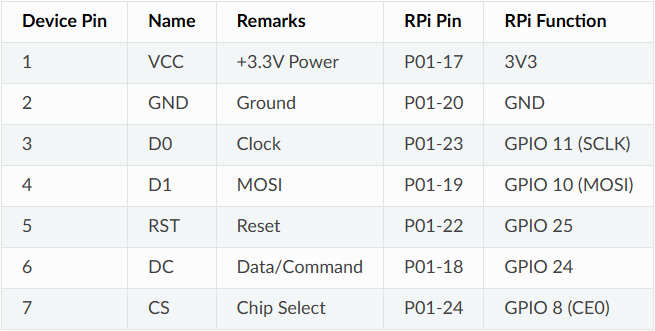

# Some commands:

scp C:\Users\gmula\Documents\GitHub\ARGlasses\ble_references.py C:\Users\gmula\Documents\GitHub\ARGlasses\display_handler.py pi@raspberrypi:/home/pi/Code/ARGlasses

This:

cd Code/ARGlasses
source /home/pi/luma-env/bin/activate

or equivalent:

source arglasses.sh

# Wiring

### Description from _luma_ docs:

### Phycal PINs (on Zero 2 W, check for other models)
(The first is the one opposite to micro usbs to the left, the second the first on the right, the third second on the left and so on):

| Pin | Number |
| --- | ------ |
| VCC | 1      |
| GND | 9      |
| DIN | 19     |
| CLK | 23     |
| CS  | 24     |
| DC  | 18     |
| RST | 22     |

### Raspberry pi zero 2 W Pinout

